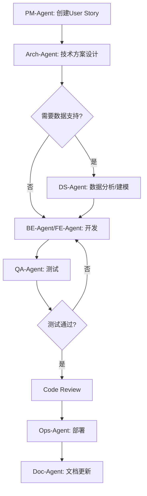

# Long COVID Risk Assessment & Symptom Pattern Analysis System
## Multi-Agent Development Plan

**项目代号**: LCRAS (Long COVID Risk Assessment System)
**开发模式**: Multi-Agent Collaborative Development
**预计周期**: 3个月 MVP, 6个月完整版
**最后更新**: 2025-12-25

---

## 🎯 项目目标

### 主系统1: 长新冠风险评估系统
**核心价值**: 帮助疫苗接种者评估长期副作用风险，提供个性化健康建议

**关键功能**:
1. 批次-长新冠症状关联分析
2. 个性化风险评分计算
3. 症状演化时间线预测
4. 交互式风险仪表盘

### 主系统2: 症状模式识别分析系统
**核心价值**: 发现隐藏的症状组合模式，为医学研究提供洞察

**关键功能**:
1. 症状聚类与关联规则挖掘
2. 患者亚群识别
3. 症状网络可视化
4. 时间序列模式发现

---

## 🏗️ 系统架构设计

### 技术栈

**后端 (Python)**:
- FastAPI: REST API服务
- Pandas/NumPy: 数据处理
- Scikit-learn: 机器学习
- NetworkX: 图分析
- Plotly: 服务端可视化

**前端 (JavaScript)**:
- React: UI框架
- D3.js: 自定义可视化
- Chart.js: 标准图表
- DataTables: 表格展示

**数据层**:
- 现有VAERS JSON数据
- SQLite: 增量数据和缓存
- Redis: 实时计算缓存

**AI/ML**:
- TensorFlow: 深度学习模型
- spaCy: NLP症状文本分析
- Prophet: 时间序列预测

### 架构图

```
┌─────────────────────────────────────────────────────────────┐
│                    Frontend Layer                            │
│  ┌──────────────┐  ┌──────────────┐  ┌──────────────┐      │
│  │ Risk Dashboard│  │Pattern Explorer│ │Symptom Network│     │
│  └──────────────┘  └──────────────┘  └──────────────┘      │
└─────────────────────────────────────────────────────────────┘
                              │
                         REST API
                              │
┌─────────────────────────────────────────────────────────────┐
│                    API Gateway (FastAPI)                     │
│  ┌──────────────┐  ┌──────────────┐  ┌──────────────┐      │
│  │ Risk Service │  │Pattern Service│ │Analytics API  │      │
│  └──────────────┘  └──────────────┘  └──────────────┘      │
└─────────────────────────────────────────────────────────────┘
                              │
┌─────────────────────────────────────────────────────────────┐
│                    Core Processing Layer                     │
│  ┌──────────────┐  ┌──────────────┐  ┌──────────────┐      │
│  │ Risk Scorer  │  │Cluster Engine│ │ Time Series   │      │
│  │              │  │              │ │ Predictor     │      │
│  └──────────────┘  └──────────────┘  └──────────────┘      │
│  ┌──────────────┐  ┌──────────────┐  ┌──────────────┐      │
│  │ Network      │  │ Association  │ │ ML Model      │      │
│  │ Builder      │  │ Rule Miner   │ │ Manager       │      │
│  └──────────────┘  └──────────────┘  └──────────────┘      │
└─────────────────────────────────────────────────────────────┘
                              │
┌─────────────────────────────────────────────────────────────┐
│                    Data Layer                                │
│  ┌──────────────┐  ┌──────────────┐  ┌──────────────┐      │
│  │ VAERS JSON   │  │ SQLite Cache │ │ Redis Store   │      │
│  └──────────────┘  └──────────────┘  └──────────────┘      │
└─────────────────────────────────────────────────────────────┘
```

---

## 🤖 Multi-Agent 开发团队设计

### Agent角色定义

#### 1. Product Manager Agent (PM-Agent)
**职责**:
- 需求分析与优先级排序
- 用户故事编写
- 迭代规划
- Stakeholder沟通

**输出物**:
- Product Requirements Document (PRD)
- User Stories (Jira/GitHub Issues格式)
- Sprint Planning文档
- Feature Roadmap

---

#### 2. System Architect Agent (Arch-Agent)
**职责**:
- 系统架构设计
- 技术选型
- API设计
- 数据库Schema设计

**输出物**:
- Architecture Decision Records (ADR)
- API Specification (OpenAPI)
- Database Schema
- Component Interaction Diagrams

---

#### 3. Data Science Agent (DS-Agent)
**职责**:
- 数据探索与分析
- 机器学习模型开发
- 特征工程
- 模型评估与优化

**输出物**:
- Jupyter Notebooks (探索性分析)
- ML模型代码
- 模型性能报告
- 数据处理Pipeline

**关键任务**:
1. **长新冠风险评分模型**
   - 逻辑回归基线
   - 随机森林分类器
   - XGBoost优化

2. **症状聚类分析**
   - K-means聚类
   - DBSCAN密度聚类
   - 层次聚类

3. **关联规则挖掘**
   - Apriori算法
   - FP-Growth优化

---

#### 4. Backend Developer Agent (BE-Agent)
**职责**:
- FastAPI服务开发
- 数据处理Pipeline
- 缓存策略实现
- 单元测试编写

**输出物**:
- Python后端代码
- API路由实现
- 数据库操作层
- 单元测试 (pytest)

**关键模块**:
```python
# 目录结构
backend/
├── api/
│   ├── routes/
│   │   ├── risk_assessment.py
│   │   ├── pattern_analysis.py
│   │   └── analytics.py
│   ├── dependencies.py
│   └── main.py
├── core/
│   ├── risk_scorer.py
│   ├── cluster_engine.py
│   ├── association_miner.py
│   └── network_builder.py
├── models/
│   ├── schemas.py
│   └── ml_models.py
├── services/
│   ├── data_loader.py
│   └── cache_service.py
└── tests/
    ├── test_risk_scorer.py
    └── test_cluster_engine.py
```

---

#### 5. Frontend Developer Agent (FE-Agent)
**职责**:
- React组件开发
- 数据可视化实现
- 用户交互设计
- 前端测试

**输出物**:
- React组件库
- D3.js/Chart.js可视化
- 响应式UI
- Jest/RTL测试

**关键组件**:
```javascript
// 组件结构
frontend/
├── src/
│   ├── components/
│   │   ├── RiskDashboard/
│   │   │   ├── RiskScoreCard.jsx
│   │   │   ├── SymptomTimeline.jsx
│   │   │   └── RecommendationPanel.jsx
│   │   ├── PatternExplorer/
│   │   │   ├── ClusterVisualization.jsx
│   │   │   ├── SymptomNetwork.jsx
│   │   │   └── AssociationRules.jsx
│   │   └── shared/
│   │       ├── DataTable.jsx
│   │       └── LoadingSpinner.jsx
│   ├── hooks/
│   │   ├── useRiskScore.js
│   │   └── useSymptomClusters.js
│   ├── services/
│   │   └── api.js
│   └── utils/
│       └── chartHelpers.js
```

---

#### 6. Data Engineer Agent (DE-Agent)
**职责**:
- 数据Pipeline优化
- ETL流程设计
- 数据质量保证
- 性能优化

**输出物**:
- 数据处理脚本
- ETL Pipeline
- 数据验证规则
- 性能基准测试

**关键Pipeline**:
```python
# 数据处理流程
data_engineering/
├── etl/
│   ├── extract_vaers_data.py
│   ├── transform_symptoms.py
│   └── load_to_db.py
├── validation/
│   ├── data_quality_checks.py
│   └── schema_validator.py
└── optimization/
    ├── indexing_strategy.py
    └── query_optimizer.py
```

---

#### 7. QA & Testing Agent (QA-Agent)
**职责**:
- 测试策略制定
- 自动化测试编写
- Bug发现与报告
- 性能测试

**输出物**:
- 测试计划
- 自动化测试套件
- Bug报告
- 测试覆盖率报告

**测试范围**:
1. **单元测试**: 所有Python/JS模块
2. **集成测试**: API端到端测试
3. **UI测试**: Selenium/Cypress
4. **性能测试**: Locust负载测试
5. **数据验证**: ML模型准确性测试

---

#### 8. DevOps Agent (Ops-Agent)
**职责**:
- CI/CD Pipeline设置
- Docker容器化
- 部署自动化
- 监控告警

**输出物**:
- Docker Compose配置
- GitHub Actions工作流
- 部署脚本
- 监控仪表盘

---

#### 9. Documentation Agent (Doc-Agent)
**职责**:
- API文档生成
- 用户指南编写
- 技术文档维护
- 代码注释审查

**输出物**:
- OpenAPI文档
- 用户手册
- 开发者指南
- 内联代码文档

---

## 📅 开发阶段与里程碑

### Phase 1: 需求与设计 (Week 1-2)

**PM-Agent 主导**:
- [ ] 用户访谈与需求收集
- [ ] 编写PRD文档
- [ ] 创建用户故事 (至少20个)
- [ ] 定义验收标准

**Arch-Agent 主导**:
- [ ] 系统架构设计
- [ ] API规范定义
- [ ] 数据库Schema设计
- [ ] 技术栈最终确认

**DS-Agent 主导**:
- [ ] 探索性数据分析 (EDA)
- [ ] 特征工程调研
- [ ] 基线模型原型

**交付物**:
- PRD v1.0
- Architecture Specification
- API Design Document
- EDA Report

---

### Phase 2: 数据准备与模型开发 (Week 3-5)

**DE-Agent 主导**:
- [ ] ETL Pipeline开发
- [ ] 数据清洗与标准化
- [ ] 数据库表创建
- [ ] 数据验证规则

**DS-Agent 主导**:
- [ ] 长新冠风险评分模型训练
  - [ ] 逻辑回归基线
  - [ ] 随机森林模型
  - [ ] XGBoost优化
  - [ ] 模型评估 (AUC, Precision, Recall)

- [ ] 症状聚类分析
  - [ ] K-means聚类
  - [ ] 肘部法则确定K值
  - [ ] 轮廓系数评估

- [ ] 关联规则挖掘
  - [ ] Apriori算法实现
  - [ ] 支持度/置信度阈值调优

**BE-Agent 支持**:
- [ ] 模型服务化接口
- [ ] 模型加载与缓存

**交付物**:
- 清洗后的数据集
- 训练好的ML模型文件
- 模型性能报告
- 特征重要性分析

---

### Phase 3: 后端开发 (Week 4-7)

**BE-Agent 主导**:
- [ ] FastAPI项目初始化
- [ ] API路由开发
  - [ ] `/api/v1/risk/score` - 风险评分
  - [ ] `/api/v1/risk/timeline` - 症状时间线
  - [ ] `/api/v1/patterns/clusters` - 症状聚类
  - [ ] `/api/v1/patterns/associations` - 关联规则
  - [ ] `/api/v1/patterns/network` - 症状网络

- [ ] 核心服务开发
  - [ ] RiskScorer类
  - [ ] ClusterEngine类
  - [ ] AssociationMiner类
  - [ ] NetworkBuilder类

- [ ] 数据访问层
  - [ ] DataLoader
  - [ ] CacheService (Redis)

- [ ] 单元测试 (目标覆盖率 >80%)

**DE-Agent 支持**:
- [ ] 数据Pipeline优化
- [ ] 查询性能优化

**QA-Agent 参与**:
- [ ] API集成测试
- [ ] 负载测试

**交付物**:
- 功能完整的后端API
- API文档 (Swagger)
- 单元测试报告
- 性能基准测试结果

---

### Phase 4: 前端开发 (Week 5-8)

**FE-Agent 主导**:
- [ ] React项目初始化
- [ ] 组件开发
  - [ ] 长新冠风险仪表盘
    - [ ] 风险评分卡片
    - [ ] 症状时间线图表
    - [ ] 个性化建议面板

  - [ ] 症状模式探索器
    - [ ] 聚类可视化 (散点图)
    - [ ] 症状网络图 (力导向图)
    - [ ] 关联规则表格

  - [ ] 共享组件
    - [ ] 数据表格组件
    - [ ] 加载动画
    - [ ] 错误边界

- [ ] API集成
  - [ ] Axios封装
  - [ ] 自定义Hooks

- [ ] 响应式设计
- [ ] 前端测试 (Jest + RTL)

**Arch-Agent 参与**:
- [ ] 组件架构审查
- [ ] 性能优化建议

**QA-Agent 参与**:
- [ ] UI自动化测试 (Cypress)
- [ ] 跨浏览器测试

**交付物**:
- 完整的前端应用
- 组件库文档
- 前端测试报告
- 响应式设计验证

---

### Phase 5: 集成与优化 (Week 8-10)

**所有Agent协同**:
- [ ] 前后端集成联调
- [ ] 端到端测试
- [ ] 性能优化
  - [ ] API响应时间优化 (<200ms)
  - [ ] 前端首屏加载优化 (<2s)
  - [ ] 数据库查询优化

- [ ] 安全加固
  - [ ] CORS配置
  - [ ] Rate Limiting
  - [ ] 输入验证

- [ ] 用户体验优化
  - [ ] 加载状态优化
  - [ ] 错误处理改进
  - [ ] 交互动画

**Ops-Agent 主导**:
- [ ] Docker容器化
- [ ] CI/CD Pipeline设置
- [ ] 监控告警配置

**交付物**:
- 集成测试报告
- 性能优化报告
- Docker镜像
- 部署文档

---

### Phase 6: 上线与迭代 (Week 11-12)

**Ops-Agent 主导**:
- [ ] 生产环境部署
- [ ] 监控仪表盘上线
- [ ] 备份策略实施

**PM-Agent 主导**:
- [ ] Beta测试协调
- [ ] 用户反馈收集
- [ ] 下一迭代规划

**Doc-Agent 主导**:
- [ ] 用户手册发布
- [ ] API文档更新
- [ ] 发布说明编写

**交付物**:
- 生产环境部署
- 用户手册 v1.0
- 发布说明
- 迭代2规划

---

## 🔄 Agent协作流程

### 日常工作流



### 代码审查流程

1. **开发完成**: BE/FE/DS-Agent创建Pull Request
2. **架构审查**: Arch-Agent审查设计合理性
3. **代码审查**: 同组其他Agent交叉审查
4. **测试审查**: QA-Agent审查测试覆盖率
5. **文档审查**: Doc-Agent审查代码注释
6. **合并**: 所有审查通过后合并

### 问题升级机制

```
Level 1: Agent内部解决 (< 2小时)
   ↓ (未解决)
Level 2: 相关Agent协商 (< 1天)
   ↓ (未解决)
Level 3: Arch-Agent介入 (< 3天)
   ↓ (未解决)
Level 4: PM-Agent调整需求/优先级
```

---

## 📊 关键指标 (KPIs)

### 开发效率指标
- **Story完成速度**: 目标 15 stories/sprint
- **代码提交频率**: 目标 >3 commits/天/Agent
- **PR平均审查时间**: 目标 <4小时
- **Bug修复时间**: P0 <4小时, P1 <1天, P2 <3天

### ��量指标
- **单元测试覆盖率**: >80%
- **集成测试覆盖率**: >70%
- **代码审查通过率**: >90%
- **Bug密度**: <0.5 bugs/KLOC

### 性能指标
- **API响应时间**: P95 <200ms
- **前端首屏加载**: <2秒
- **ML模型推理时间**: <50ms
- **数据库查询时间**: <100ms

### 用户指标
- **风险评分准确率**: >85%
- **症状聚类质量**: 轮廓系数 >0.6
- **关联规则置信度**: >70%
- **用户满意度**: >4.0/5.0

---

## 🛠️ 工具链

### 项目管理
- **GitHub Projects**: 任务看板
- **GitHub Issues**: User Stories & Bugs
- **GitHub Milestones**: 里程碑跟踪

### 开发工具
- **VS Code**: 统一IDE
- **Jupyter Lab**: 数据科学探索
- **Postman**: API测试
- **Docker Desktop**: 本地环境

### CI/CD
- **GitHub Actions**: 自动化构建测试
- **Docker**: 容器化
- **Pytest**: Python测试
- **Jest**: JavaScript测试

### 监控与日志
- **Prometheus**: 指标收集
- **Grafana**: 可视化仪表盘
- **ELK Stack**: 日志分析
- **Sentry**: 错误追踪

---

## 🔐 安全与合规

### 数据隐私
- [ ] 去标识化处理
- [ ] 敏感数据加密
- [ ] 访问权限控制
- [ ] 审计日志

### API安全
- [ ] HTTPS强制
- [ ] JWT认证
- [ ] Rate Limiting
- [ ] CORS配置

### 合规性
- [ ] GDPR合规 (如适用)
- [ ] HIPAA合规审查
- [ ] 数据使用协议

---

## 📚 参考文档

### 学术论文
- [ ] Long COVID症状研究综述
- [ ] 疫苗批次变异性研究
- [ ] 症状聚类方法学

### 技术文档
- [ ] FastAPI官方文档
- [ ] React官方文档
- [ ] Scikit-learn文档
- [ ] D3.js可视化指南

### 数据来源
- [ ] VAERS数据字典
- [ ] 医学症状本体 (SNOMED CT)
- [ ] 药物不良反应术语集 (MedDRA)

---

## 🎓 知识共享

### 每周分享会
- **周一**: PM-Agent分享用户需求洞察
- **周三**: DS-Agent分享模型进展
- **周五**: 技术分享 (轮流)

### 文档库
- [ ] 技术决策记录 (ADR)
- [ ] 最佳实践文档
- [ ] 常见问题解答
- [ ] 新人入门指南

---

## 🚀 下一步行动

### 立即启动 (本周)
1. **PM-Agent**: 编写详细PRD
2. **Arch-Agent**: 完成架构设计
3. **DS-Agent**: 启动EDA

### 准备工作 (下周)
1. **DE-Agent**: 设计ETL Pipeline
2. **BE-Agent**: 初始化FastAPI项目
3. **FE-Agent**: 初始化React项目
4. **QA-Agent**: 编写测试计划

### 资源需求
- [ ] 开发服务器 (8核16G内存)
- [ ] GPU服务器 (模型训练)
- [ ] 数据库服务器
- [ ] GitHub Team账号

---

**文档版本**: v1.0
**维护者**: Multi-Agent Development Team
**审查周期**: 每Sprint一次
**最后审查**: 2025-12-25
